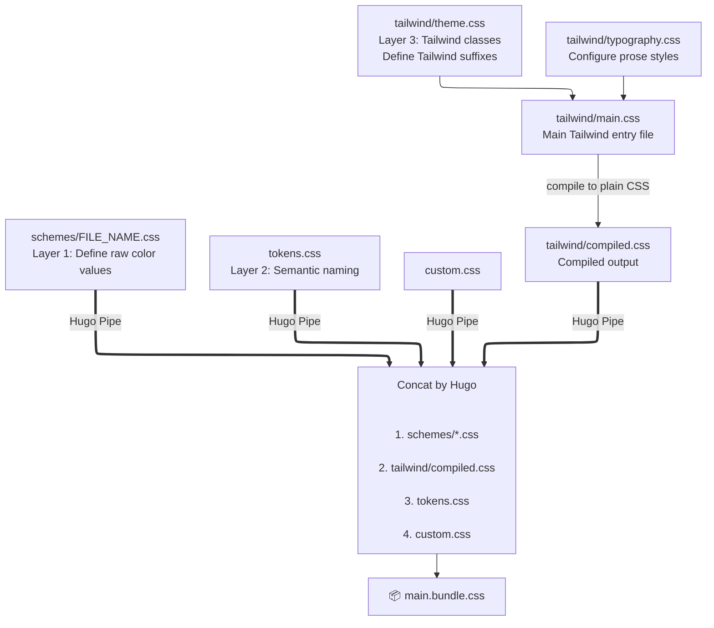

## Override Templates

Hugo provides a robust mechanism for template overriding. If the default layout or functionality of a specific theme component does not meet your requirements, you can **override** it by recreating the file at the equivalent path within your project's root directory.

This approach ensures that your customizations remain intact while allowing the underlying theme to be updated independently.

### Usage Example

- Customize Footer

    You can modify the theme's default footer without altering the original theme files, follow these steps:

    1. Locate the target partial in the theme directory:
    `themes/hugo-yore/layouts/_partials/footer.html`
    2. Create a corresponding file in your project root: `layouts/_partials/footer.html`
    3. Implement your custom HTML within this new file.

- Customize Syntax Highlighting Style

    These commands generate CSS to `chroma.css`, overriding the theme's built-in `chroma.css`.

    ```sh
    # Mac/Linux
    (echo 'html[data-theme=light] {'; hugo gen chromastyles --style=emacs; echo '}') > assets/css/chroma.css
    (echo 'html[data-theme=dark] {'; hugo gen chromastyles --style=evergarden; echo '}') >> assets/css/chroma.css

    # Windows PowerShell
    # This command cannot run in CMD; it must run in PowerShell
    @("html[data-theme=light] {"; (hugo gen chromastyles --style=emacs); "}") | Add-Content -Path "assets/css/chroma.css"
    @("html[data-theme=dark] {"; (hugo gen chromastyles --style=evergarden); "}") | Add-Content -Path "assets/css/chroma.css"
    ```

    See all available styles in the [Hugo's documentation](https://gohugo.io/quick-reference/syntax-highlighting-styles/#styles).

## Extend Templates

Yore provides reserved partial hooks within the `_partials` directory, allowing for content injection at specific locations. This method is preferred over full template overrides when appending or prepending code.

### Available Extension Points

Files in `layouts/_partails`:

- **`extend-head.html`**: Injected in the `<head>`, after main CSS and before all deferred JavaScript.
- **`extend-body-end.html`**: Injected immediately before the closing `</body>` tag.
- **`page/content-before.html`**: Injected before `{{ .Content }}` in the `page` template.
- **`page/content-after.html`**: Injected after `{{ .Content }}` in the `page` template.

Files in `assets`:

- **`css/custom.css`**: Loaded at the end of all CSS files and bundled into the full CSS.

### Usage Examples

- Site Verification and Search Console

    To add site verification tags for Google Search Console or other services, edit `layouts/_partials/extend-head.html`:

    ```html {title="layouts/_partials/extend-head.html"}
    <meta name="google-site-verification" content="YOUR_VERIFICATION_CODE" />

    <script async src="https://www.googletagmanager.com/gtag/js?id=G-XXXXXXXXXX"></script>
    <script>
      window.dataLayer = window.dataLayer || [];
      function gtag(){dataLayer.push(arguments);}
      gtag('js', new Date());
      gtag('config', 'G-XXXXXXXXXX');
    </script>
    ```

- Injecting Conditional Assets

    To load specific stylesheets for pages under the `/events` path, edit `layouts/_partials/extend-head.html`:

    ```go-template {title="layouts/_partials/extend-head.html"}
    {{ if hasPrefix .Page.Path "/events" }}
      {{ with resources.Get "css/events.css" }}
        {{ $eventsCSS := . | minify | fingerprint }}
        <link rel="stylesheet" href="{{ $eventsCSS.RelPermalink }}" integrity="{{ $eventsCSS.Data.Integrity }}">
      {{ end }}
    {{ end }}
    ```

- Stale Content Warning

    Use `layouts/_partials/page/content-before.html` to display a notification if an article has not been updated for over a year:

    ```html {title="layouts/_partials/page/content-before.html"}
    <div id="stale-warning"></div>
    <script src=...>
    ```

## Customize CSS

> [!IMPORTANT]
> CSS customization is intended for advanced users.

Yore provides an `assets/css/custom.css` entry to include your own stylesheets. This file is loaded at the end of all CSS files and bundled into the full CSS.

Understanding Yore's 3-layered CSS architecture facilitates more effective customization.

### Concept

[Tailwind](https://tailwindcss.com/) and the [typography plugin](https://github.com/tailwindlabs/tailwindcss-typography) are responsible for the major layout framework, and the color/padding/margin of components are also set by Tailwind utilities. All other CSS settings are loaded by Hugo pipes as plain CSS instead of being compiled into the Tailwind bundle.

This is Yore's CSS file architecture:

```text
assets/css
├── schemes
│   ├── avocado.css
│   ├── blowfish.css
│   └── ...
├── tailwind
│   ├── components
│   │   ├── admonition.css
│   │   └── code.css
│   ├── compiled.css
│   ├── main.css
│   ├── theme.css
│   └── typography.css
├── a11y.css
├── basic.css
└── ...
````

And this shows how they are loaded:



Tailwind is compiled into `compiled.css` when the theme is released, so users receive plain CSS. You do not need to install or run any Tailwind tooling to use the theme.

All files outside the `tailwind` folder are loaded as plain CSS, allowing you to override specific components without changing the Yore preset.

### Variable Architecture

Yore uses a simple three-layer variable system to make theming predictable and easy to override:

1. Base Colors: Raw color values defined in `schemes/`.
2. Semantic Tokens: Purpose-based names defined in `tokens.css`.
3. Tailwind Tokens: Tailwind utilities mapped to semantic tokens in `theme.css`.

Because Tailwind utilities reference CSS variables, you can customize the entire theme by overriding variables, no rebuild required.

#### Base Colors

Schemes use an 11-step scale across three main color types:

```css
:root {
  /* Neutral colors for backgrounds and text */
  --color-neutral-50: oklch(98.5% 0.003 60);
  /* ... steps 100 to 900 ... */
  --color-neutral-950: oklch(12% 0.004 35);

  /* Brand colors for main identity */
  --color-accent-50: oklch(97.5% 0.015 165);
  /* ... steps 100 to 900 ... */
  --color-accent-950: oklch(20% 0.03 165);

  /* Accent colors for highlights */
  --color-brand-50: oklch(98% 0.03 125);
  /* ... steps 100 to 900 ... */
  --color-brand-950: oklch(25% 0.06 125);
}
```

This is complete the same as Tailwind default levels. You can generate your own schemes using any [Tailwind color generator](https://www.google.com/search?q=Tailwind+color+generator), add them to `custom.css` in Yore's format, and a custom theme is easily created.

Yore natively supports the OKLCH color model, which allows you to define colors semantically. OKLCH separates colors into three components:

- **Lightness (L)**: How bright the color is  
- **Chroma (C)**: How strong or vivid the color is  
- **Hue (H)**: The color’s angle on the color wheel  

OKLCH is much more predictable than RGB, where it is not possible to tweak a color by editing the RGB value. With OKLCH, you can adjust brightness, intensity, or hue independently, making it intuitive to adjust a certain just by value.

Learn more on the [MDN documentation](https://developer.mozilla.org/en-US/docs/Web/CSS/Reference/Values/color_value/oklch#values).

#### Semantic Tokens

`assets/css/tokens.css` defines all color nicknames. This avoids repeating color codes and ensures consistent appearance.

Example customization in `assets/css/custom.css`:

```css
html[data-theme='light'] {
  --muted: red;
  --muted-foreground: brown;
}


html[data-theme='dark'] {
  --muted: green;
  --muted-foreground: lime;
}
```

#### Tailwind Tokens

Yore uses custom Tailwind tokens defined in `assets/css/tailwind/theme.css`.

Semantic tokens are integrated into Yore's custom Tailwind tokens. Instead of default classes like `bg-red-50`, Yore uses `bg-CUSTOM_TOKEN` to maintain thematic consistency across the site.

The class structure uses standard Tailwind prefixes (text-, bg-, border-) paired with the custom suffixes. This results in classes such as text-muted or bg-brand-foreground. Since `theme.css` references variables from `tokens.css`, you can modify specific colors via CSS variables without rebuilding Tailwind.

### Building Your Own TailwindCSS

You can also build your own Tailwind CSS if you need extra Tailwind classes.

> [!INFO]
> This is more advanced than `custom.css` customization and requires `pnpm` and TailwindCSS.

Steps:

1. Install `pnpm`.
2. Copy `package.json` and `assets/css/tailwind/` from the theme source.
3. Run `pnpm i`.
4. Use Tailwind classes like `bg-red-500/87` and build with `pnpm run build:css`.
5. Confirm `compiled.css` includes `bg-red-500\/87`.

Tailwind v4 [scans all project files](https://tailwindcss.com/docs/detecting-classes-in-source-files#which-files-are-scanned), so Yore installed via Git submodule requires no additional setup. For Hugo module installation, vendor Yore first using [hugo mod vendor](https://gohugo.io/commands/hugo_mod_vendor/).
