```mermaid
sequenceDiagram
    participant web as Web Browser
    participant blog as Blog Service
    participant account as Account Service
    participant mail as Mail Service
    participant db as Storage

    Note over web,db: The user must be logged in to submit blog posts
    web->>+account: Logs in using credentials
    account->>db: Query stored accounts
    db->>account: Respond with query result

    alt Credentials not found
        account->>web: Invalid credentials
    else Credentials found
        account->>-web: Successfully logged in

        Note over web,db: When the user is authenticated, they can now submit new posts
        web->>+blog: Submit new post
        blog->>db: Store post data

        par Notifications
            blog--)mail: Send mail to blog subscribers
            blog--)db: Store in-site notifications
        and Response
            blog-->>-web: Successfully posted
        end
    end
```

## Mermaid

`mermaid` allows you to draw detailed diagrams and visualisations using text. It uses Mermaid under the hood and supports a wide variety of diagrams, charts and other output formats.

Refer to the [official Mermaid docs](https://mermaid-js.github.io/) for details on syntax and supported diagram types.

**Example:**

`````md
```mermaid
graph LR;
A[Lemons]-->B[Lemonade];
B-->C[Profit]

```
`````


`````md

`````


`````md

`````


